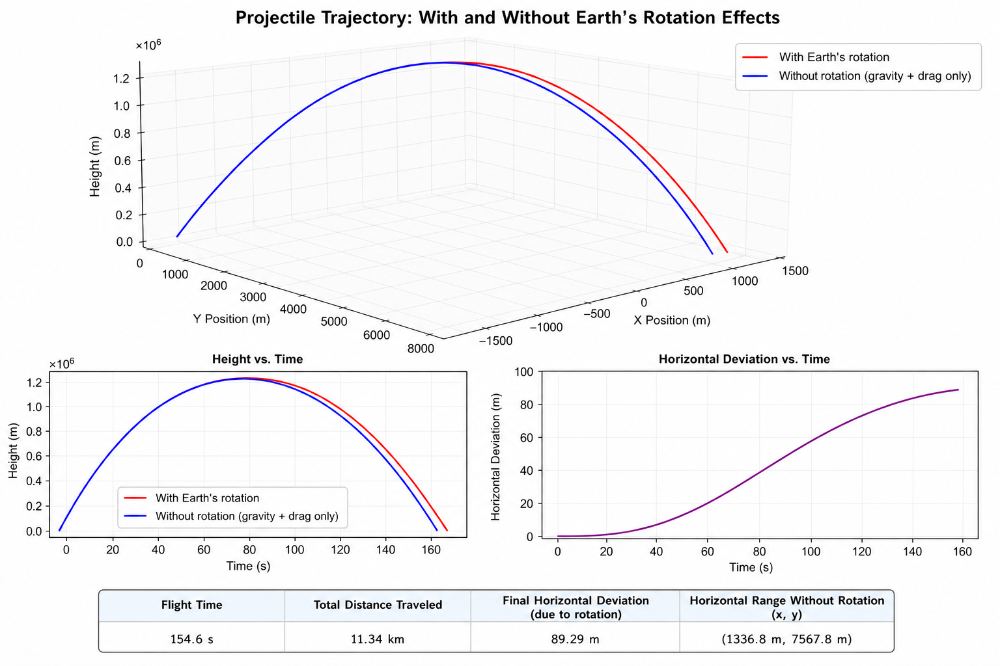

# Coriolis Projectile Simulation

## Overview

This project simulates the trajectory of a projectile under the influence of:

* Gravity
* Linear air drag
* Coriolis acceleration
* Centrifugal acceleration

The goal is to analyze how Earth's rotation affects the motion compared to a simplified model with only gravity and drag.

---

## Main result



This figure summarizes the simulation:

* 3D trajectory with and without Earth's rotation
* Height evolution over time
* Horizontal deviation caused by rotation
* Key metrics such as flight time and total distance

---

## Horizontal deviation


The Coriolis effect introduces a lateral displacement that grows over time.

Although small for short trajectories, the deviation becomes significant over longer distances.

---

## Top view of the trajectory


The horizontal projection clearly shows the deviation between:

* The trajectory with Earth's rotation
* The reference trajectory (gravity + drag only)

This view makes the Coriolis effect much easier to visualize.

---

## Physical interpretation

* Without rotation, motion is confined to a vertical plane
* With rotation, the projectile experiences lateral acceleration
* The deviation depends on velocity, latitude, and flight time

---

## Usage

Install dependencies:

```bash
pip install numpy matplotlib
```

Run the simulation:

```bash
python coriolis_projectile.py
```

---

## Project structure

```text
.
├── coriolis_projectile.py
├── figures/
│   ├── Comparations.png
│   ├── HorizontalDesv vs time.png
│   └── XY view.png
└── README.md
```

---

## Conclusion

The simulation shows that Earth's rotation introduces measurable deviations in projectile motion.

Even in simple models, the Coriolis effect becomes visible when analyzing trajectories in detail, especially in the horizontal plane.
